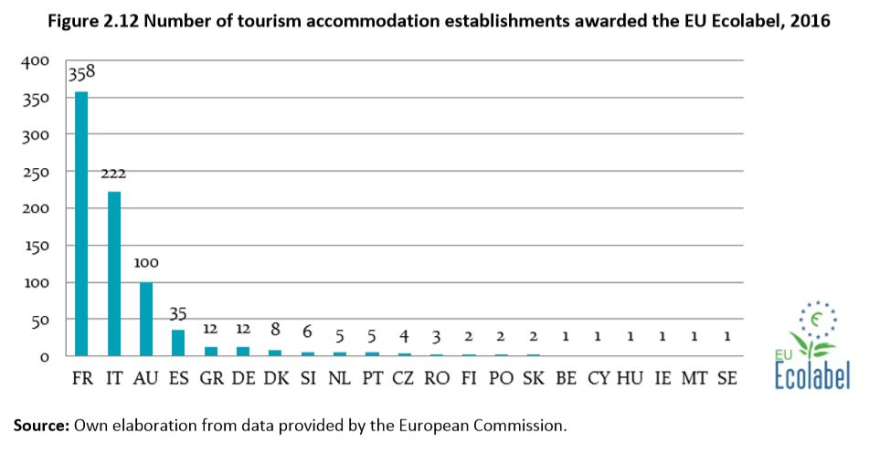

[Back](https://akshata95.github.io/StoryTellingWithData)
[Part 1](final_project_Akshata.md)

## You can find the final project [here](https://carnegiemellon.shorthandstories.com/sustainable-tourism/index.html)

# Part 1 

### Project outline & proposal
Tourism has always been – from a historical perspective – a societal response to the human need for
wellbeing and personal development, through interaction with other people and the environment.
Globally, demand for tourism and recreation opportunities has grown steadily over the last decades and
tourism development, beyond its contribution to national economies, is a major driving force that
impacts essential environmental assets (air, water, biodiversity, soil, land), both in tourist destinations
(locally) and on a global scale.

Tourism is of major importance to European economies, but a damaged environment could undermine
tourism in the future, because tourism needs a clean and attractive environment. Therefore, it is
necessary to monitor and measure the impact of tourism on the environment, and implement tourismrelated policies to ensure greater sustainability of the sector.

### Story Arc
#### Europe Tourism and its impact on environment -
Europe is the world’s primary tourist destination, largely due to its combined natural and cultural attractiveness, as well as other economic and social features. 
 
Tourism is of major importance to European economies, but a damaged environment could undermine tourism in the future, because tourism needs a clean and attractive environment. Therefore, it is necessary to monitor and measure the impact of tourism on the environment, and implement tourismrelated policies to ensure greater sustainability of the sector. 
 
#### Promoting sustainability of tourism - 
At the European level, tourism policy is mainly focussed on the competitiveness of the sector worldwide, while tourism- and environment-related policies in Europe are not about specific legislation and targets. All environmental aspects and references to the sustainability challenges of the tourism sector (which includes tourist accommodation establishments, food and beverage establishments, tourism-related transport, recreational activities, travel agencies, tour operators, etc.) are fragmented and dispersed across sector-based policies and the acquis communautaire. At the same time, many EU environmental sector-based policies, such as those on waste, water, terrestrial and marine biodiversity, air, soil and climate change, identify tourism as a sector whose environmental sustainability is becoming more and more essential. 
 

### Choosing the methodology 
For the purpose of the final project, I will be creating a page using shorthand as a platform. 
I will use a combination of rawgraphs.io, datawrapper.de and tableau as visualization tools, as well as Adobe Illustrator for possible final touches & other visualizations that I deem neccessary to convey the story.

### Finding datasets:
The datasets are mainly for the reader to understand the imoact of tourism on environment and how it can be made sustainable. For this, we'll first analyze and see the tourism traffic in Europe to assimilate the extent of the issue.
Then we see the impact of tourism on the environment and suggest mitigation tasks to make tourism sustainaable.

#### To understand European tourism

[Number of establishments and bed places](https://ec.europa.eu/eurostat/databrowser/bookmark/bfaa1d8e-a1d6-4e72-957b-0a32f72e32d6?lang=en)

[Arrivals of residents/non-residents at tourist accommodation establishments](https://ec.europa.eu/eurostat/databrowser/bookmark/7eeb0126-eadb-4faf-8974-d91a1ded30e2?lang=en)

#### Impact of tourism on environment 

[Pollutant emissions from transport](https://ec.europa.eu/eurostat/databrowser/bookmark/71b330a5-24eb-40c1-8d9f-5b0d5a93d003?lang=en)

[Water Productivity](https://ec.europa.eu/eurostat/databrowser/bookmark/7a63816e-605f-4c2f-a440-9c3b3d843d6b?lang=en)

### Sketches: 
First geospatial graph to show the extent of tourism in Europe with respect to the world- 

[source](https://www.unwto.org/archive/global/publication/unwto-tourism-highlights-2016-edition)

Showing increase in tourism in European countries from 2000 to 2015 -

[source](https://www.eea.europa.eu/data-and-maps/figures#c0=15&c5=&c15=all&b_start=0)

Impact of tourism on water quality - 

[source](https://www.eea.europa.eu/data-and-maps/figures#c0=15&c5=&c15=all&b_start=0)

Measures taken to make tourism more sustainable -
Environmental certification/labelling in the tourism sector - 

# Part II: final project
I decided to increase the scope of the project after thinking about it and initial feedback from my peers. The story now consists of four elements; the tourism market in Europe, how it has grown because of influence of social media, the impact it has on water and air pollution and lastly, measures taken to make tourism sustainable. 

### target audience
My target audience are people with some general knowledge or experience with visualizations, and those who are able to or want to think critically. I would say my target audience also understands effects of tourism on the environment and importance of necessary steps to be taken in order to make tourism a sustainable source of income and recreation.  

### in-detail storyboard
Please note that this is just an indicator of the final version of the project, and the data visualizations/sources/text area's are not final (as I will probably be making changes during this & following weeks). This was used as a storyboard visualisation for my interviewees. 
[storyboard](https://preview.shorthand.com/mJibOZl0ZJ1dOuRX)

#### Visualizations
i have a total of 6 visualizations and have worked on 5 of them. The 6 th one will either be a geospatial map providing insight about the actins taken to make tourism more sustainable.

There are 3 key takeaways in the story. 
#### The first being: 

Tourism has been around since centuries but has exponentially increased because of social media. the environmental impact that tourism has on Earth is irrevocable and we need to spread awareness about the same

#### The second key takeaway is: 

The only way to go forward is support eco tourism and sustainable tourism to protect our beautiful Earth while enjoying it's beauty.

#### The last takeaway is: 

When visualizations are used to create a story, one should think about why the creator is trying to tell that story. 

### With the final message being: 

Stories, data and visualizations do not always allign or create a picture of reality. In the end, you are responsible for thinking for yourself and creating that picture of reality. 

### Visualizations I showed to my interviewees: 

Visualization 1 : This has been made using paint

Visualization 2 : This was made on excel 

Visualization 3 : This was made on paint and powerpoint

[source](https://stackla.com/resources/blog/5-statistics-that-prove-social-media-will-influence-your-next-travel-destination/)

Visualization 4 :This was made on Tableau

Visualization 5 :This was made on Tableau

[source](https://www.eea.europa.eu/data-and-maps/data/bathing-water-directive-status-of-bathing-water-7)

Visualization 6 : sketched as of now

#### The story I told the interviewees: 
Today we're looking at a story which has been supoorted by visualizations - It's with respect to sustainable tourism focusing on Europe.
Part 1 - Why Europe has been chosen.
Part 2 - Ever increasing source of recretion, with aid of social media.
Part 3 - Effects it has on the environment.
Part 4 - Mitigation actions and precautions taken.

## user-research protocol
The key aspects I will try to uncover during the interviews are
	Do the examples in the story fit the story? 
	Do the visualizations add value to the story?
	What might be confusing about the visualizations?
	What would you have done differently in these visualisations? 
	Do you feel like there is a clear message at the end of the story? 
	
I start my interview by stating the following questions: 
//I'm going to tell you a story which is supported by visualizations, could you tell me how and in what these graphics help underline the story?

Follow-up questions might be: 
//What part of the graphics were confusing to you? 
//If you were to retell this story, what would you change? 

## individual interview 1
//I'm going to tell you a story which is supported by visualizations, could you tell me how and in what these graphics help underline the story?

Response: 1st visualization - does bring out the 51% share Europe has for all tourist arrivals and brings out the point in the first instance.

2nd visualization - The comparison of tourist arrivals between 2000 and 2016 cn be done on the same axis instead of two different for quicker understanding.

3rd visualiaztion - The cameras are a little distracting since they are different, try using the same camera in different colors.

4th visualization - you can combine rail if they are not of too much significance and you donot intend to highlight those. Use of colors for Marine and road are apt and increasing trend of marine is highlighted.

5th visualization - You need to separate the graphs and increase the intensity of the red color. if excellent quality of water is not your focus you can choose to exclude it from the graph.

6th visualization - you should go ahead with the geospatial depiction of certificates issued, you started with the globalmap and are concluding focusing on a particular area with a particular conclusion.

## individual interview 2
//I'm going to tell you a story which is supported by visualizations, could you tell me how and in what these graphics help underline the story?

Response: A similar reaaction for the first two visualizations. The 3rd visualization was appreciated.
For air pollution (4th visualization) it would be better to increase the font of the axis.
For bathing water quality (5th visualization) the grey is being ignored. otherwise it is a good representation.

All your visualizations do have a flow and are relevant to the story you are telling.

## individual interview 3
//I'm going to tell you a story which is supported by visualizations, could you tell me how and in what these graphics help underline the story?

Response: 
The social media graph. Does it have something to do with girls and boys? If not then the colors are too obvious and you need to change that.
The water pollution graph needds to be on the same axis. A significant difference wouldv'e been better for this kind of chart but since the difference isn't much, comparing them on the same axis will be more insightful.

The flow is good and the visualizations are relevant. 

## Insights for changes made to sketches, storyboards & wireframes
Well.. I'm happy with the result. The interviewees had similar views which is good because it means there are structured few places i need to rectify.

In order to fit my project within the timeframe of the final presentation, I've been struggling with keeping the stories short and to the point. 

Changes that will be made to the project and presentation:	
- Project: 
	- I need to vocalize the various assumptions I make better.  
	- In order to show the relationship between a data and a story, I need to visualize this. This is mainly for the presentation, as my audience needs to quickly grasp that they don't allign at all times.  
	- For the project I will take the time to type out the assumptions, as I want the final project to read like a well thought out article. 
	
Visualizations:
	- The arrivals comparison needs to be changed to the same axis.
	- Sources needs to be properly added to the final versions which will be made in Tableau
	- Titles needs to be improved upon for all visualizations to tell the story. The reader goes from reading the title to trying to understand the graph, I need to focus on that. 
	- The current visualization for the social media gives pre-conceiveed notions about it being for girls and boys.

I'm still working on the improvements but I'm very happy with the results so far. 
#### improved visualization after feedback  
Visualization 3 : Color chart changed slightly so as to not give the reader any pre-conceived notions

[source](https://stackla.com/resources/blog/5-statistics-that-prove-social-media-will-influence-your-next-travel-destination/)

Visualization 2 : As all interviewees suggested it to be on the same axis for ease of understanding, the following change was made -

# Part III & IV: final project
#### Work, final decisions, observations &* audience
A major change has been made from the last iteration of the final project; the focus is now on flow of causation. It helps the reader relate as to why this topic, why is it a concern and how to go about sustaining this sector. This is because I observed the audience needed a thread to follow. So I included more content in the social media effects. I also included an easy to read impactful table that explains the effects of our actions as tourists on the environment. 

In the first feedback round, it was clear to me that my original nneded to be tweaked. After making the changes to the environmental effects graphs,  The work was made in Tableau, with certain elements (the camera graph  and social media influence images) edited in Paint. 

The intended audience is therefore those who are interested in learning more about impact of social media on tourism and in turn on environment , as well as those who are just looking for an 'interesting and fun read'. I believe that I succeeded in creating the visualizations accessible for the general public and understanding. 

#### Executive summary
Tourism has always been – from a historical perspective – a societal response to the human need for wellbeing and personal development, through interaction with other people and the environment. Globally, demand for tourism and recreation opportunities has grown steadily over the last decades and tourism development, beyond its contribution to national economies, is a major driving force that impacts essential environmental assets (air, water, biodiversity, soil, land), both in tourist destinations (locally) and on a global scale. 
 
The surge in specific types of tourism (ex. cruise tourism) and the increased frequency of holidays due to impact of social media have serious environmental impacts at the regional and local level, also depending on the seasonality of tourist flows. Particularly, major tourist destinations are faced with challenges related to water supply, pressure on local water sources, waste generation and management, as well as wastewater generation and treatment, which may exceed, in some cases, the carrying capacity of the territories (especially small and medium-sized islands). Also, land take and soil sealing, air and noise pollution from local means of transport, as well as visual pollution by the ever-expanding built-up areas, represent other – quite common – traceable consequences of tourism development. 
 
Tourism is of major importance to European economies, but a damaged environment could undermine tourism in the future, because tourism needs a clean and attractive environment. Therefore, it is necessary to monitor and measure the impact of tourism on the environment, and implement tourismrelated policies to ensure greater sustainability of the sector. 
 

#### Major elements
##### The story arc consists of four major visual elements to support the general story. It starts with the choice of Europe since its the primary tourist destination

##### Next, it shows the the impact of social media on tourism. 

##### Next, we see how tourism has affected air and water in Europe over the years

##### Finally, the key visualizations that promote eco-tourism adn the call to action. In case the audience member has not yet had their 'oh! I see'-moment, these visualizations should incur that.

#### Final work
*Final story link:*

You can find the final project [here](https://carnegiemellon.shorthandstories.com/sustainable-tourism/index.html).
**important note:** 

*References:*

Inspiration for World Map illustration - [UNWTO](https://www.e-unwto.org/doi/pdf/10.18111/9789284419029)  

Tourist Arrivals datasets - [Link](https://ec.europa.eu/eurostat/statistics-explained/index.php?title=Tourism_statistics)

Social Media 1 - [Link](http://fredericgonzalo.com/en/2018/06/04/the-impact-of-social-media-in-travel-infographic/)

Social Media 2 - [Report](https://stackla.com/wp-content/uploads/2019/02/Data-Report-2019-FINAL-FINAL.pdf)

Social Media 3 - [Report](https://stackla.com/wp-content/uploads/2019/02/Data-Report-2019-FINAL-FINAL.pdf)

Increase in carbon-di-oxide levels - [Link](https://www.eea.europa.eu/publications/air-quality-in-europe-2016)

Bathing water quality - [Link](https://www.eea.europa.eu/publications/european-bathing-water-quality-2015)

Call to action sources - 
[Nearly Zero Energy Hotels](https://ec.europa.eu/energy/intelligent/projects/en/projects/nezeh)

[Link](https://www.tandfonline.com/doi/abs/10.1080/09669582.2015.1008500)

[Blue Flag Certification](https://planbleu.org/sites/default/files/publications/3-8-en_synthesesardaigne.pdf)

The visualizations were created with a combination of Paint and Tableau. 

[Back](https://akshata95.github.io/StoryTellingWithData)

